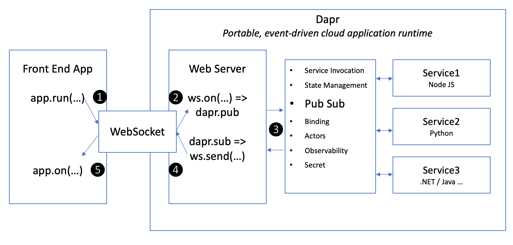

## Use AppRun with Dapr

[AppRun](https://github.com/yysun/apprun) is a JavaScript library for building reliable, high-performance web applications using the Elm-inspired architecture, events, and components.

[Dapr](https://dapr.io) is a portable, serverless, event-driven runtime that makes it easy for developers to build resilient, stateless and stateful microservices that run on the cloud and edge and embraces the diversity of languages and developer frameworks..

We can connect AppRun events to Dapr PubSub through WebSockets. This project is a demo of using AppRun with Dapr.



## How It Works

The original AppRun event lifecycle when user clicks the button is:

1. User click the button
2. The Counter component publishes an AppRun local event ('-1' or '+1')
3. The Counter component handles the '-1'/'+1' event; calculates and returns the new state. AppRun renders the new state.

Now, let's send a message to Dapr and let the Dapr service do the calculation:

1. User click the button
2. The Counter component publishes an AppRun local event ('-1' or '+1')
3. The local event handler publishes an AppRun global event: '@ws' with payload _{event: 'add', data: [state, delta]}_
4. AppRun global event handler sends the payload to the WebSocket
5. The web server (index.js) receives the WebSocket message and then publishes an Dapr PubSub message
6. The Dapr service (service.js) receives the Dapr message. It does the 'add' calculation and then publishes the result to Dapr PubSub
7. The web server receives the Dapr message and send it back to the client through the WebSocket
8. The client side app receives the WebSocket message and publishes an AppRun global event '@@'
9. The Counter component handles the '@@' event and sets the new state. AppRun renders the new state.


Welcome to the world of microservices, CQRS, and Dapr.


## Start the Services

```
npm start
```

## Run the Frontend App

http://localhost:8000

Watch messages in the server console and browser console.


Have fun.

(C) 2021 Yiyi Sun
