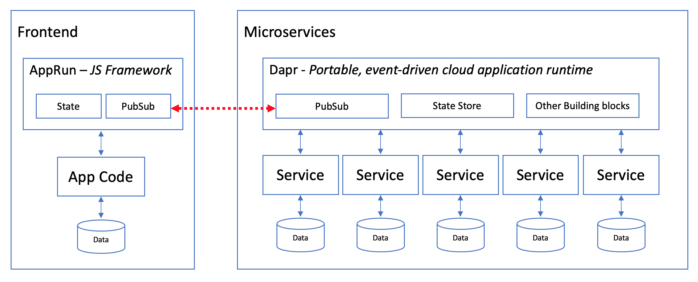

## Use AppRun with Dapr

Welcome to the world of AppRun, microservices, CQRS, and Dapr. This is a demonstration of using AppRun with microservices built with Dapr.

* [AppRun](https://github.com/yysun/apprun) is a JavaScript library that uses the Elm-inspired architecture, events, and components.
* [Dapr](https://dapr.io) is a portable, serverless, event-driven runtime for building resilient, stateless and stateful microservices.




## How It Works

### Fornt End

The front end is a SPA built with AppRun has three pages, in which there are a counter app page and a todo app page.

#### Counter App Page


#### Todo App Page


### Backend

The backend microservices are built with Dapr, which includes,

* a service to perform the add calculation for the counter
* a state service to save app states to Dapr state store
* a todo app service that saves a todo list to redis
* a todo stream service that saves a todo list to redis stream
* a todo sql service that saves a todo list to sql database

### Architecture

Because AppRun is event-driven, We can connect AppRun events to Dapr PubSub through WebSockets.


## Getting Started

[Install Dapr CLI](https://docs.dapr.io/getting-started/install-dapr-cli/) and [Initialize Dapr](https://docs.dapr.io/getting-started/install-dapr-selfhost/) if you haven't.

Run in terminal:

```
npm install
npm start
```

* Run the Frontend App http://localhost:8000
* Run the Dapr Dashboard http://localhost:8080
* Run the Zipkin http://localhost:9411

Watch messages in the server console and browser console.


Have fun.

(C) 2021 Yiyi Sun
